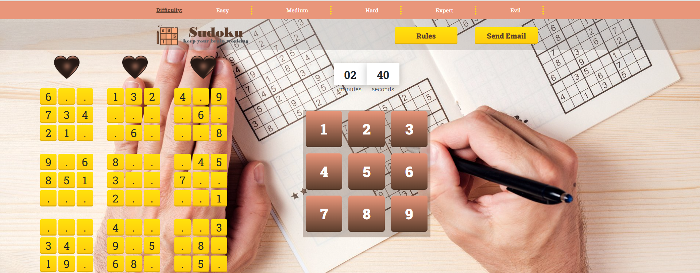
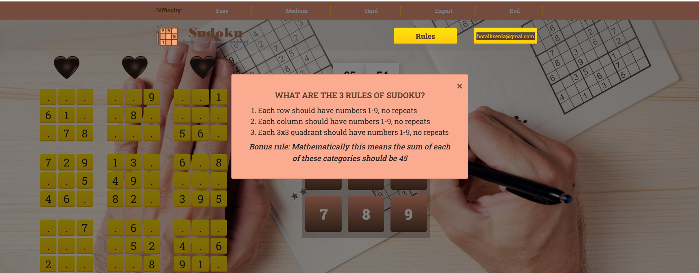

# mySudoku game

### Introducing mySudoku: A Challenging Puzzle Game for Your Browser  
*Welcome to mySudoku, the ultimate web-based game that will put your logical thinking and problem-solving skills to the test!*  
  
#### Key Features: 
  
**Interactive Gameplay:** mySudoku provides a user-friendly and intuitive interface, making it easy to navigate and play. You can effortlessly interact with the game board, selecting cells and inputting numbers to solve the puzzle.  
  
**Difficulty Levels:** Challenge yourself with a range of difficulty levels, including easy, medium, hard, expert, and evil modes. 
  
**Solving technique:** mySudoku game utilizes a backtracking algorithm - a powerful technique commonly used in Sudoku solving.  

**Error Detection:** Worried about making mistakes? mySudoku has got you covered! The game features an error detection system that highlights incorrect entries, allowing you to identify your mistakes and maintain accuracy.  
  
**Timer and Lives:** Test your speed and efficiency with the built-in timer, which keeps track of the time it takes you to solve each puzzle. Additionally, there are three hearts located on the screen that keep you informed about your remaining lives.  
  
**Relaxing Visuals and Sound:** Immerse yourself in a visually pleasing environment with a clean and minimalistic design. The soothing color palette and beautiful interface create a calming atmosphere, allowing you to focus on the puzzle-solving challenge. I also plan on adding optional background music and sound effects to further enhance the overall experience!  
  
*Keep an eye out for the exciting upcoming features!*  

•	Keyboard input  
•	Relaxing music  
•	The "Show Solution" button  

